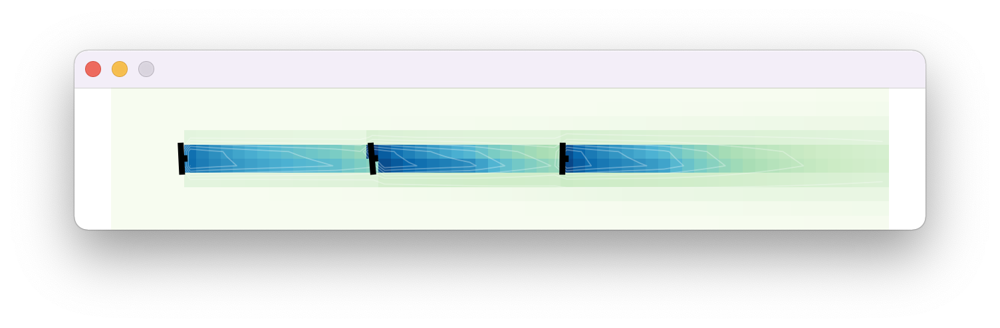

# wind-farm-env
[](LICENSE)

This repository contains the source code and data for the experiments presented in
_Deep Reinforcement Learning for Active Wake Control_ (to be published at AAMAS'22).

## How to Use This Repository

### Replicating the Experiments

The current version of the repository contains only the environment itself, so that users do not have to download the experiments presented in the paper if they do not need them.

If you are interested in the scripts and configurations for the experiments or the supplementary material for the original paper, please check the release 0.0.1 of this repository for the code and the instructions.

### Building from the Source Code

If you are interested in using the wind farm environment with your own reinforcement learning agents, you can build and
install a Python package that will make the environment available on your machine.

First, make sure that you have `build` installed by running `python3 -m pip install --upgrade build`.

Next, build the package by running `python3 -m build` from the project's directory. For linux based systems you can be asked to install `python3-venv` (i.e. `apt install python3-venv`).

This will create `./dist` with 
a `wind_farm_gym-<VERSION>-py3-none-any.whl` file in it, where `<VERSION>` is the current release version.

Finally, install the package by running `python3 -m pip install dist/wind_farm_gym-<VERSION>-py3-none-any.whl`, or
`python3 -m pip install dist/wind_farm_gym-<VERSION>-py3-none-any.whl --force-reinstall` if you want to reinstall an existing
installation. This should install the package and its dependencies.

To test that the package is available and working, you can run the  following example, also  available at
[build-test.py](https://github.com/AlgTUDelft/wind-farm-env/blob/main/build-test.py). A simulation window should
appear on your screen showing an overhead view of a three-turbine wind farm.

```python
from wind_farm_gym import WindFarmEnv

# Initialize the environment with 3 turbines positioned 750 meters apart in a line
env = WindFarmEnv(turbine_layout=([0, 750, 1500], [0, 0, 0]))

obs = env.reset()
for _ in range(1000):                # Repeat for 1000 steps
    a = env.action_space.sample()    # Choose an action randomly
    obs, reward, _, _ = env.step(a)  # Perform the action
    env.render()                     # Render the environment; remove this line to speed up the process
env.close()
```



## Citation

Please, cite the paper if you use it:

```
@inproceedings{Neustroev2022,
  title     = {Deep Reinforcement Learning for Active Wake Control},
  author    = {Neustroev, Grigory and Andringa, Sytze P.E. and Verzijlbergh, Remco A. and de~Weerdt, Mathijs M.},
  booktitle = {International Conference on Autonomous Agents and Multi-Agent Systems},
  year      = {2022},
  address   = {Online},
  publisher = {IFAAMAS},
  month     = {May},
  numpages  = {10}
}
```
